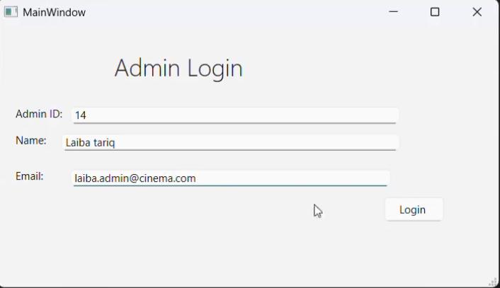
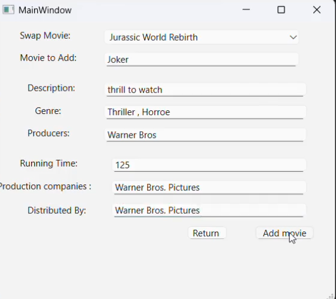

# Cinema Ticket Booking System

## Overview
This is a **Cinema Ticket Booking System**, developed as a university Database Management Systems (DBMS) project.  
The system allows customers to browse movies, select showtimes, submit bookings, view their booking history, and cancel bookings — all via a **PyQt6 GUI application** connected to a SQL Server database.

This project demonstrates **GUI development, database integration, and customer workflow management**.

---

## Customer-Side Features (My Contributions)
- Designed and implemented the **customer-facing UI** using **Qt Designer + PyQt6**.
- Developed workflows for customers to:
  - Browse movies and select showtimes
  - Submit bookings to the database
  - View booking history
  - Cancel bookings
- Connected the UI to a **SQL Server database** using `pyodbc`.
- Created and maintained **customer-related database tables and queries**.
- Tested and debugged the customer-side application for a smooth user experience.

---

## Technologies Used
- Python 3.x
- PyQt6 (GUI)
- SQL Server / pyodbc
- Qt Designer (UI design)
- Git & GitHub

---

## Some Demo Screenshots

### Admin Login Screen

### Admin Add Movie Screen

### Customer Movie Selection

### CUstomer's Ticket Generated

### Customer's Booking History

